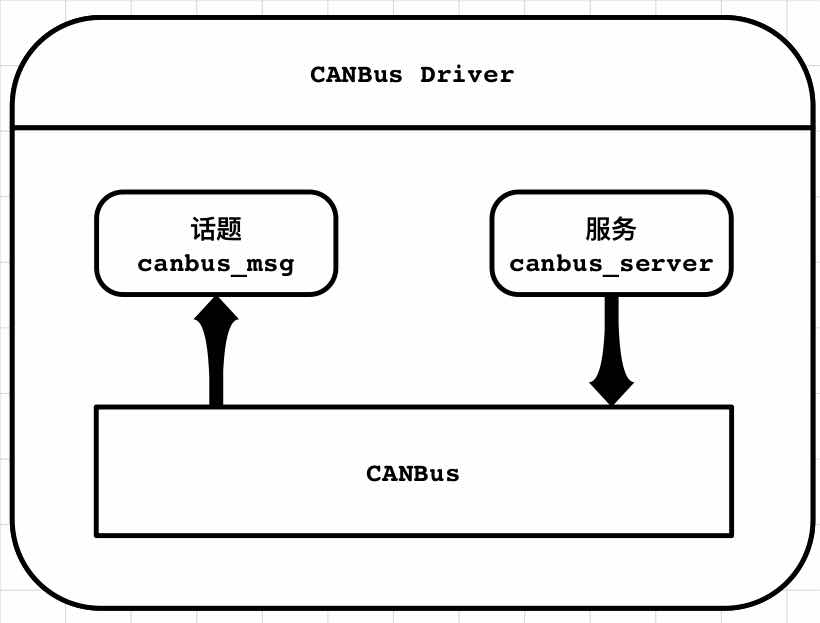

# Autolabor ROS 驱动模块

##  1. 介绍
Autolabor ROS驱动模块包含**CANBus驱动**和**Autolabor PM1底盘驱动**，其主要功能包括与Autolabor_CANbus模块通信，并通过线速度和角速度控制Autolabor PM1底盘行驶。

#### 特性

- 可直接获取CANBus网络内数据，并通过CAN指令控制车辆
  - 获取动力轮编码器原始数值
  - 获取转向轮编码器原始数值
  - 分别控制动力轮的转速
  - 控制转向轮的绝对转向角度
- 可通过线速度与角速度控制移动底盘，无需单独控制后轮转向
- 提供实时机器人底盘位置信息，方便闭环控制
- 双动力轮电子差速控制，保证机器人在行驶过程中始终满足阿克曼原理
- 根据后轮转向优化车辆运动速度，在保证车辆在行驶精度前提下，确保车辆行驶的流畅性

## 2. 节点

### 2.1 canbus_driver
该节点提供与底层AutoCan的通讯，将CAN网络中的数据进行解析并发布至canbus_msg话题中，并开启canbus_server服务，提供其他节点调用，用以发送CAN指令到CAN网络中。

该节点的结构如图所示：

#### 2.1.1 订阅话题
无

#### 2.1.2 发布话题
/canbus_msg  ([autolabor_canbus_driver/CanBusMessage](doc/CanBusMessage.md))
~~~
将底层CAN网络中的数据发布在ROS话题中，提供其他节点读取
~~~

#### 2.1.3 服务
/canbus_server  (autolabor_canbus_driver/CanBusService)
~~~
提供其他节点调用，用于往底层CAN网络中发布指令
~~~

#### 2.1.4 参数
~port_name  (str, default: /dev/ttyUSB0)
~~~
CANBus串口端口名
~~~

~baud_rate  (int, default: 115200)
~~~
CANBus串口波特率
~~~

~parse_rate  (int, default: 100)
~~~
数据解析器从串口获取新数据的频率
~~~
