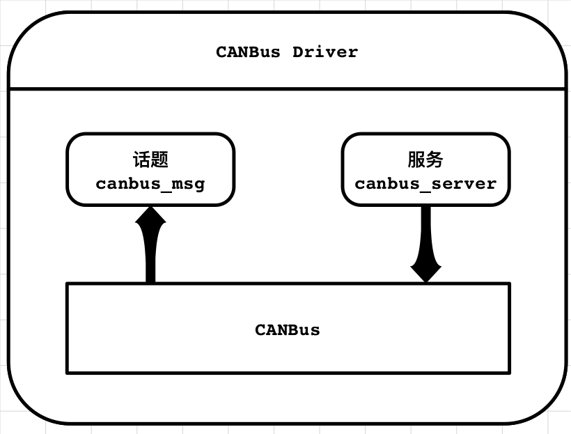
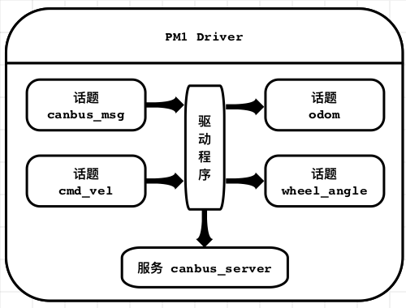

# Autolabor ROS 驱动模块

##  1. 介绍
Autolabor ROS驱动模块包含**CANBus驱动**和**Autolabor PM1底盘驱动**，其主要功能包括与Autolabor_CANbus模块通信，并通过线速度和角速度控制Autolabor PM1底盘行驶。

#### 特性

- 可直接获取CANBus网络内数据，并通过CAN指令控制车辆
  - 获取动力轮编码器原始数值
  - 获取转向轮编码器原始数值
  - 分别控制动力轮的转速
  - 控制转向轮的绝对转向角度
- 可通过线速度与角速度控制移动底盘，无需单独控制后轮转向
- 提供实时机器人底盘位置信息，方便闭环控制
- 双动力轮电子差速控制，保证机器人在行驶过程中始终满足阿克曼原理
- 根据后轮转向优化车辆运动速度，在保证车辆在行驶精度前提下，确保车辆行驶的流畅性

## 2. 节点

### 2.1 canbus_driver
该节点提供与底层AutoCan的通讯，将CAN网络中的数据进行解析并发布至canbus_msg话题中，并开启canbus_server服务，提供其他节点调用，用以发送CAN指令到CAN网络中。

该节点的结构如图所示：
<div align=left>
	
</div>

#### 2.1.1 订阅话题

无

#### 2.1.2 发布话题
/canbus_msg  ([autolabor_canbus_driver/CanBusMessage](doc/CanBusMessage.md))
~~~
将底层CAN网络中的数据发布在ROS话题中，提供其他节点读取
~~~

#### 2.1.3 服务
/canbus_server  ([autolabor_canbus_driver/CanBusService](doc/CanBusService.md))
~~~
提供其他节点调用，用于往底层CAN网络中发布指令
~~~

#### 2.1.4 参数
~port_name  (str, default: /dev/ttyUSB0)

~~~
CANBus串口端口名
~~~

~baud_rate  (int, default: 115200)
~~~
CANBus串口波特率
~~~

~parse_rate  (int, default: 100)
~~~
数据解析器从串口获取新数据的频率
~~~

### 2.2 pm1_driver

此节点主要用于接收用户发送的速度信息，控制转向轮转动，并根据后轮当前角度结合阿克曼模型优化求解动力轮的转动速度，控制移动底盘进行移动，同时根据动力轮编码器的反馈，输出轮速里程计信息。

该节点结构如下：

<div align=left>
	
</div>

#### 2.2.1 订阅话题

/cmd_vel ([geometry_msgs/Twist](http://docs.ros.org/api/geometry_msgs/html/msg/Twist.html))

```
外部节点发送的速度信息
```

/canbus_msg ([autolabor_canbus_driver/CanBusMessage](doc/CanBusMessage.md))

```
由canbus_driver发送的底层CANBus消息，其中包含转向轮当前绝对编码器以及动力轮的编码器信息
```

#### 2.2.2 发布话题

/odom ([nav_msgs/Odometry](http://docs.ros.org/api/nav_msgs/html/msg/Odometry.html))

```
根据动力轮以及转向轮的编码器信息，依据车辆运动模型，计算出的轮速里程计信息
```

/wheel_angle ([std_msgs/Float64](http://docs.ros.org/api/std_msgs/html/msg/Float64.html))

```
转向轮实时绝对转角，单位rad
```

#### 2.2.3 服务

无

#### 2.2.4 参数

~odom_frame (str, default: odom)

```
里程计坐标系名称
```

~base_frame (str, default: base_link)

```
移动底盘坐标系名称
```

~ecu_left_id (int, default: 0)

```
左侧动力单元的CAN节点编号（出厂已设置好，无需修改）
```

~ecu_right_id (int, default: 1)

```
右侧动力单元的CAN节点编号（出厂已设置好，无需修改）
```

~tcu_id (int, default: 0)

```
转向单元的CAN节点编号（出厂已设置好，无需修改）
```

~rate (int, default: 10)

```
速度控制以及里程计更新频率，单位 Hz
```

~reduction_ratio (double, default: 20.0)

```
动力单元编码器与车轮转速比例(和机械结构相关，无需修改)
```

~encoder_resolution (double, default: 1600.0)

```
动力单元编码器转动一圈产生的脉冲数(与编码器参数相关，无需修改)
```

~wheel_diameter (double, default: 0.211)

```
动力轮车轮直径，单位 m
```

~wheel_spacing (double, default: 0.412)

```
动力轮轮间距(两个动力轮中心之间的距离)，单位 m
```

~shaft_spacing (double, default: 0.324)

```
前后轮轴间距(转向轮中心到动力轮连线的距离)，单位 m
```

~max_speed (double, default: 2.0)

```
机器人底盘直线行驶最大速度，单位 m/s
```

~twist_timeout (double, default: 1.0)

```
速度控制超时时间，底盘的保护策略，最近一次的速度控制信息距当前时间超过这个时间，则强制移动地盘停止，单位 s
```

~path_weight (double, default: 1.5)

```
速度控制优化参数，用于表示控制要求预期行驶到的目标点距离约束条件下行驶路径建距离的权重，权重越高，表示行走越准确，但行驶平滑程度越低。（数值要求大于等于0）
```

~endpoint_weight (double, default: 1.0)

```
速度控制优化参数，用于表示车辆在约束条件下预期行驶到的目标点和控制要求预期行驶到的目标点间距离的权重，权重越高，表示行驶线速度越接近指定线速度（数值要求大于0）
```

~angle_weight (double, default: 0.5)

```
速度控制优化参数，用于表示车辆在约束条件下预期行驶到的目标点和控制要求预期行驶到的目标点间航向角差距的权重，权重越高，表示行驶角速度越接近指定角速度（数值要求大于0）
```

#### 2.2.5 TF转换信息

odom -> base_link

```
提供车体坐标系与里程计坐标系间转换关系
```

